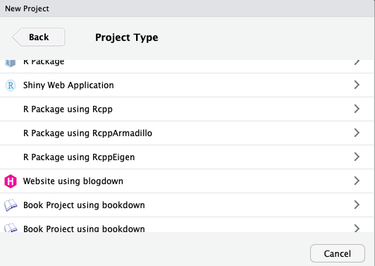
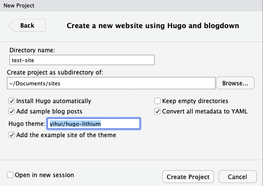
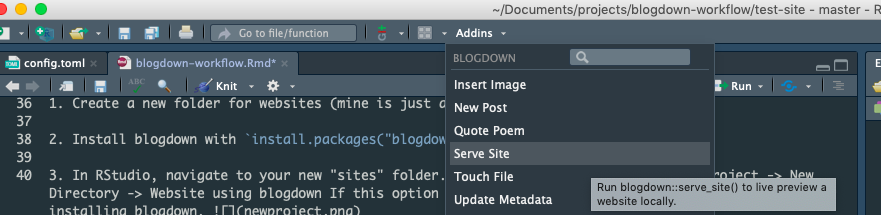
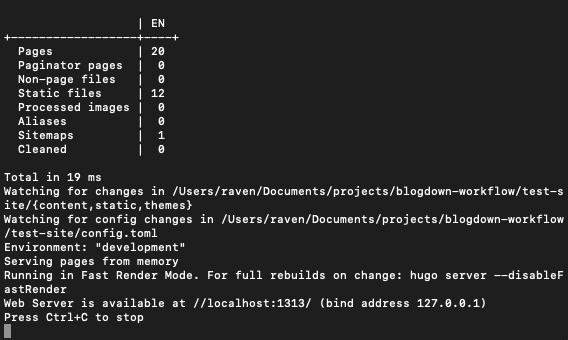
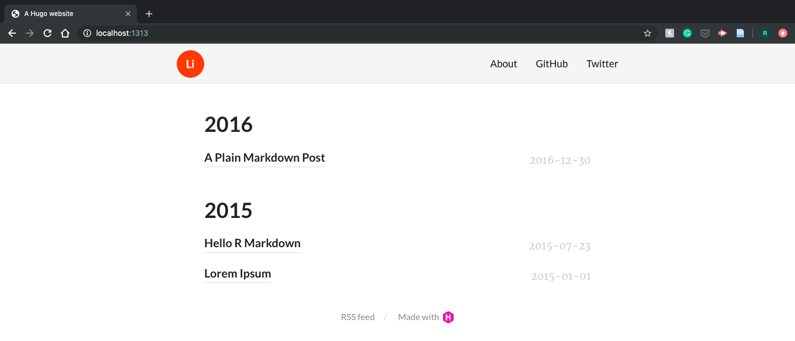
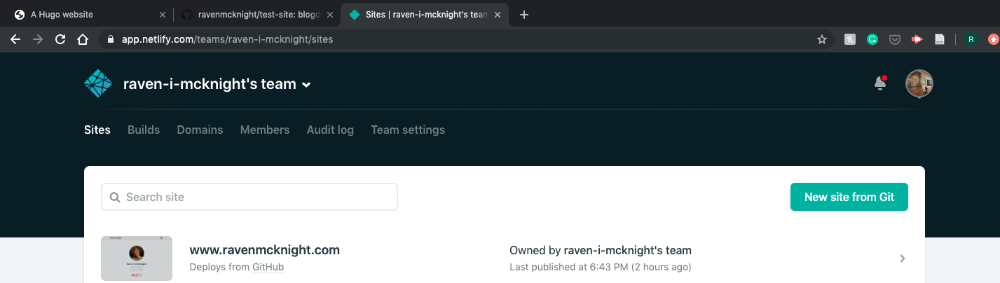
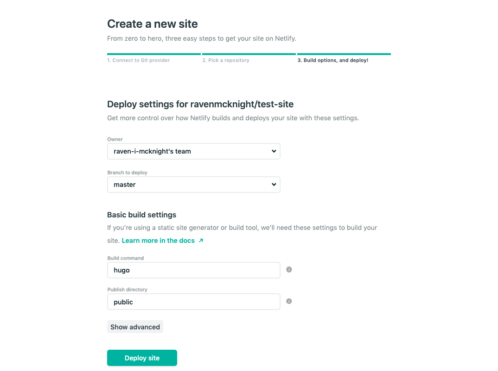
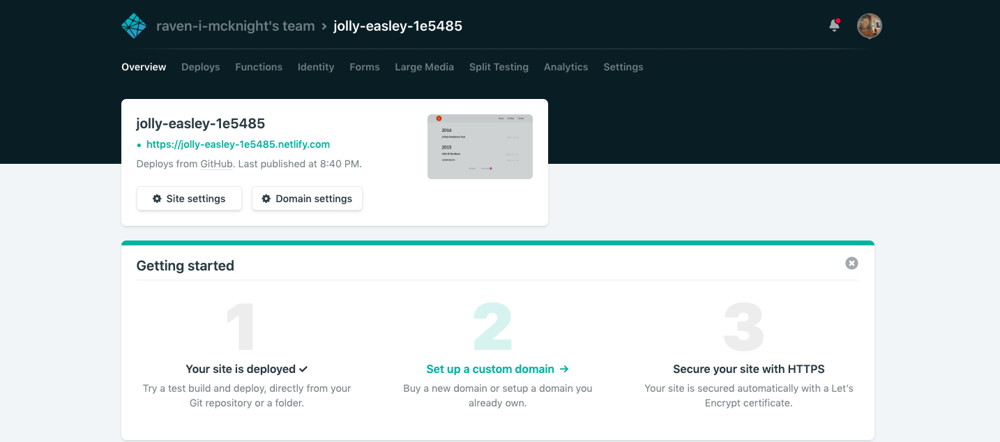

```{r setup, include=FALSE}
knitr::opts_chunk$set(echo = TRUE)
```

# Intro

Blogdown is an R package which allows us to build whole websites in R(!!!!). 
When I was learning blogdown, a lot of tutorials missed the mark for me. They tended to either gloss over key points or include too much detail to be immediately helpful. This is *my* blogdown workflow. I'm not sure if it's "best practices" but it works well for me!

# Choosing a theme

You could argue that you shouldn't worry about the appearance of your site right off the bat but with blogdown, it does change your file structure a little depending on the theme you choose. I would start by browsing the themes [here](https://themes.gohugo.io/) and choosing one you like. 

There are a few themes that are widely used, like Hugo Academic or Creative Portfolio. Choosing one of these means your site will be less unique, but it also means that more people are working with it so you'll be more likely to find answers if you need to Google questions down the line! I would recommend googling themes you're thinking about before you get too involved to see if a) thereare many questions/answers already online and b) if the Github page for the theme is still being actively updated by the creator. 

For reference, [my site](ravenmcknight.com) uses Hugo Academic and [Katie Jolly's home page](katiejolly.io) uses the Creative Portfolio theme. 

Once you have a theme you like, find the Github page for that theme (usually linked somewhere pretty obvious). You'll need the URL of the repository for the theme to install the theme later. For example, if I want to use the Hugo Lithium theme by yihui [here](https://github.com/yihui/hugo-lithium), I'll need "yihui/hugo-lithium" in the next step. 

# Set up

Setting your blogdown up locally is super easy! Here's what I did: 


1. Install blogdown with `install.packages("blogdown")`

2. Install hugo (this is to work with themes and publishing). I installed from the terminal using Homebrew with `brew install hugo`. There's more documentation about installation [here](https://gohugo.io/getting-started/installing/).

3. Create a new folder for websites (mine is just at Documents/sites)

3. In RStudio, navigate to your new "sites" folder. In the menu, select File -> New Project -> New Directory -> Website using blogdown If this option doesn't show up, you might need to restart R after installing blogdown. 



4. Once you select "Website using blogdown", you'll see this screen:  

Here, set the directory name to the name of your website and the highlighted field to the Github repo for the theme you'd like to use. Once you're happy with that, click "Create Project." This will create a new folder containing all of the code for your new site!

This is all you need to do to get a basic site working locally. 

To check out the site, you can use Addins -> Serve Site in RStudio  This will create a local preview of the site in your Rstudio viewer panel. This will likely be a super simple version of the site with a few stock images and Lorem Ipsum example posts. 

You can also preview your site from the terminal with hugo. In the terminal, navigate to the folder your site is in (for me, `cd Documents/sites/test-site`). Then, run `hugo server`. A bunch of code will flash by and then it should look like this:  


If this works, you can type "//localhost:1313/" into your browser URL and see a preview of your site: 


Just make sure to follow the instructions and press Ctrl+C when you're done previewing!

# Customize locally

This is the part that's hard to tutorial-ize because it can be so different depending on your theme. If you're using the Academic theme, there's a whole set of [documentation](https://sourcethemes.com/academic/docs/) to reference. No matter what your theme is, I would suggest **working from the example site you just previewed!!!** I've had a lot of success by starting with the basic file structure and playing with the pre-populated posts to figure out how they work. I might write more about this part of the process later!

# Publish!

Once you're happy with your local preview, we can publish the site pretty easily. You can publish using Github Pages fairly easily, but I use Netlify. More computer sciency people have told me it's better but I can't pretend I know why :-) This part is a little more complicated but if you're comfortable with Github it's not crazy. I'll try to outline each step here!

1. Build the site. Once you're happy with the preview, either use the "Serve Site" addin 1 last time, or run "hugo" (not "hugo server") in the terminal. This generates the files we need to actually publish the site. 

2. Push these files to a Github repo! I'll assume you know how to do to this part but there are plenty of tutorials/I can help if you need! 

3. Now, we go to [Netlify](https://www.netlify.com/). Create an account and then from the home screen you should be able to click "New site from Git": 



This will walk you through connecting Netlify with Github and selecting a repo to host your site from (in my case, "test-site"). Then, you'll get this screen: 



These presets have always worked for me! Click Deploy Site. If all goes well, this will load for a while and then you'll see this screen: 



Netlify will have given your site a crazy temporary url, but if you click on it, you'll get to your freshly published site! Here's mine: [https://jolly-easley-1e5485.netlify.com/](https://jolly-easley-1e5485.netlify.com/). You can do things like update your URL or buy a custom domain through Netlify!

# Updating your site

The process you just went through set your site up for continuous deployment through Github. This means that it's super easy to update your site as you add more posts/projects!

Whenever I'm adding a new post, `hugo server` to preview each change I make until I'm happy and want to make the change public. Once I'm ready to publish, I run `hugo` from the terminal to build my files. Then (from the same folder), `git add .` and push to your repo. This will start the process of re-deploying your site. You can monitor the deployment from Netlify but usually within a few seconds, you'll be able to see the updated version of your site at it's regular URL!


# Quick example

Here's a quick example for adding content! Let's say I wanted to add this tutorial to the blog "test-site" I just created. 
